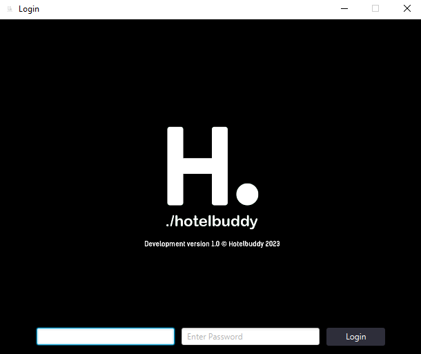

# HotelBuddy

Hotelbuddy is a easy to use hotel managing program.

#### Login using your credentials provided by your administrator

<!-- TEXT -->


## Dashboard


# Features
- Room bookings
  - Changeable room contents
  - Room cleaning booking
- Bookings with multiple rooms
  - Room service
  - Invoices
  - Booking confirmation
- Guest Lists
- Multiple Employees
- Dashboard with statistics
    - Shared notes between Employees
- Diffrent settings
  - Both dark and Light mode
  - The ability to change what type of room content is available for rooms

# Setup guide

- Main app configuration

  - Config db.con.txt

    Create a db.con.TXT file in the root directory of the hotelbuddy.jar file

    #### Example of db.con.txt

    ```Text
    192.168.0.1/db_name,username,password
    ```

    Deafult db_name is hoteldb

- Database setup (Mysql/Mariadb)

  - Importing hoteldb.sql file into database

    hoteldb.sql is located "resources\material\DB"


## Default credentials

    Username: Admin
    Password: 123

<H2 style="color:red">Important!</H2>
Change the admin password the first time you login!

#

## Problems
[See all bugs](https://gitlab.lnu.se/1dt908/student-projects/hotelbuddy/-/issues/?sort=created_date&state=opened&label_name%5B%5D=BUG%21&first_page_size=20)

## Debug
Run jar file with
```
java -jar hotelbuddy.jar
```

# Tests

- Link to test documentation:
  - [Test Documentation](https://docs.google.com/spreadsheets/d/1ekbHSfJcPwGCz10f51uJKAD6k-VZ0KSYevuqHD460qI/edit?usp=sharing)
